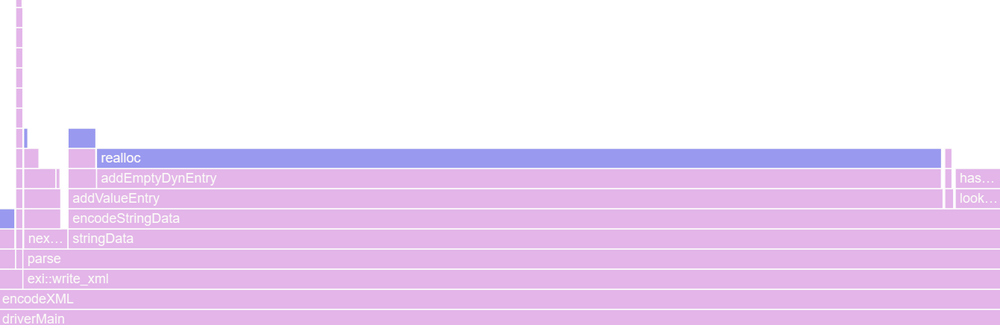
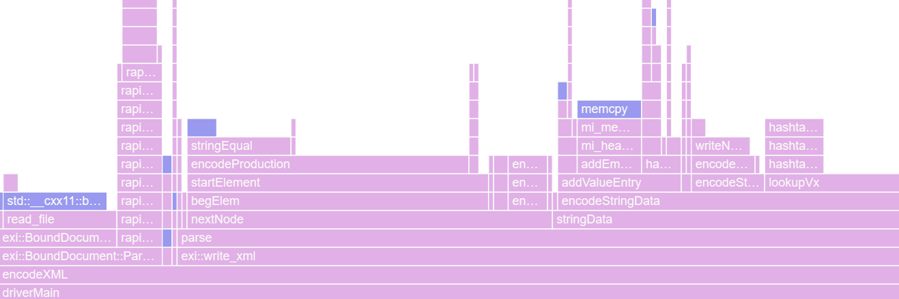

# Changes to exip

To get exiCPP as efficient and usable as possible, I had to make some changes.
These range from minor tweaks to complete overhauls of old systems.
Here are the major ones:

## Pretty Printing

The first thing I worked on was making debug information prettier.
This meant adding file, line, and statement information.
To handle this, I added [``errorHandle.c``](https://github.com/8ightfold/exiCPP/blob/main/vendored/exip/src/common/src/errorHandle.c).
The new functions implented optional ANSI printing,
as well as formatting for the new debugging information.

## Promotion Error

While testing compression, I found that the program would
sometimes crash seemingly at random.
The crash happened in [``decodeStringValue``](https://github.com/8ightfold/exiCPP/blob/517d6a8ac6b9eee84d63702de84087e953dc403c/vendored/exip/src/contentIO/src/bodyDecode.c#L884) when the crosstable would sometimes get massively out of bounds indexes.
After an hour of debugging, I realized the mistake.

In [``decodeNBitUnsignedInteger``](https://github.com/8ightfold/exiCPP/blob/73c0b321b1d1b3944bd46fbdc30eed3c3d9b60ce/vendored/exip/src/streamIO/src/streamDecode.c#L54), you had the following:

```cpp
unsigned long tmp_byte_buf = 0;
...
for(unsigned int i = 0; i < byte_number * 8; i += 8) {
  // Buf is a char*.
  tmp_byte_buf = strm->buffer.buf[strm->context.bufferIndx] << i;
  ...
}
```

This might not look like much, but the error becomes clear when you look at
[negative values](https://godbolt.org/z/bYMvvnTrP).
When using implicit conversions from ``char`` to ``unsigned``,
the value is first sign-extended to an ``int``, and then converted to ``unsigned``.
This logic is wrong.

The correct sequence is followed here:

```cpp
for(unsigned int i = 0; i < byte_number * 8; i += 8) {
  // Buf is a char*.
  const unsigned char val = strm->buffer.buf[strm->context.bufferIndx];
  tmp_byte_buf = val << i;
  ...
}
```

This first converts the value to an ``unsigned char``,
which is zero-extended to an ``unsigned``.
This keeps the representation of values greater than ``127`` consistent.

## Performance

While exip was relatively efficient when encoding small files,
there were major problems with large files.
Encoding ``treebank_e.xml`` (an 82MB file) from [this dataset](https://aiweb.cs.washington.edu/research/projects/xmltk/xmldata/www/repository.html) took **10+ hours**!

So I booted up VTune and started profiling.


### Exponential Lookup

The first bottleneck I noticed was in ``lookupVx``.

I started by switching from byte-by-byte string comparisons to ``strncmp``,
but this had almost no impact on the performance with this file.

The *real* change came about when I noticed crosstable lookups weren't
using the hashtable like normal lookups.
Instead, it was looping through every entry and doing a string comparison.

To leverage the hashtable, I did the following:

```cpp
const Index vi = hashtable_search(valueTable->hashTbl, valueStr);
if (vi == INDEX_MAX)
  return FALSE;

for (Index i = 0; i < vxTable->count; ++i) {
  vxEntry = vxTable->vx + i;
  if(vxEntry->globalId == vi) {
    *vxEntryId = i;
    return TRUE;
  }
}
```

First, we check if the element even exists in the hashtable.
If it does, we loop through the table,
doing cheap integer comparisons until we find our element.

This change alone dropped runtime down to **20 seconds**!



### Improved Allocation

Originally, exip used the standard ``malloc`` and ``realloc`` for dynamic allocation.
While this works fine for smaller files, once fixing string lookup,
this became a major bottleneck on larger files.
To combat this, I switched to [mimalloc](https://github.com/microsoft/mimalloc).

After fixing some stray ``malloc`` calls, and some other slight tweaks,
The runtime was reduced to **7 seconds**.


### Better String Map

My final optimization was to update the hashtable.
The old implementation was from 2002, using the DJB hashing algorithm.
While it was probably good for the time, it was time for it to go.
I replaced it with my own [C port](https://github.com/8ightfold/exiCPP/blob/517d6a8ac6b9eee84d63702de84087e953dc403c/vendored/exip/src/common/src/new_hashtable.c) of LLVM's ``StringMap``, alongside [rapidhash](https://github.com/Nicoshev/rapidhash).

With that, I got the encoding time down to **2.5 seconds**!
This means even extremely large files can be encoded with exiCPP.


